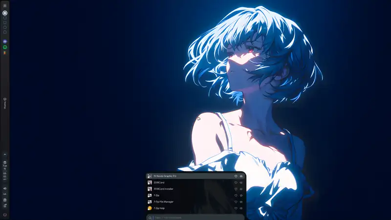
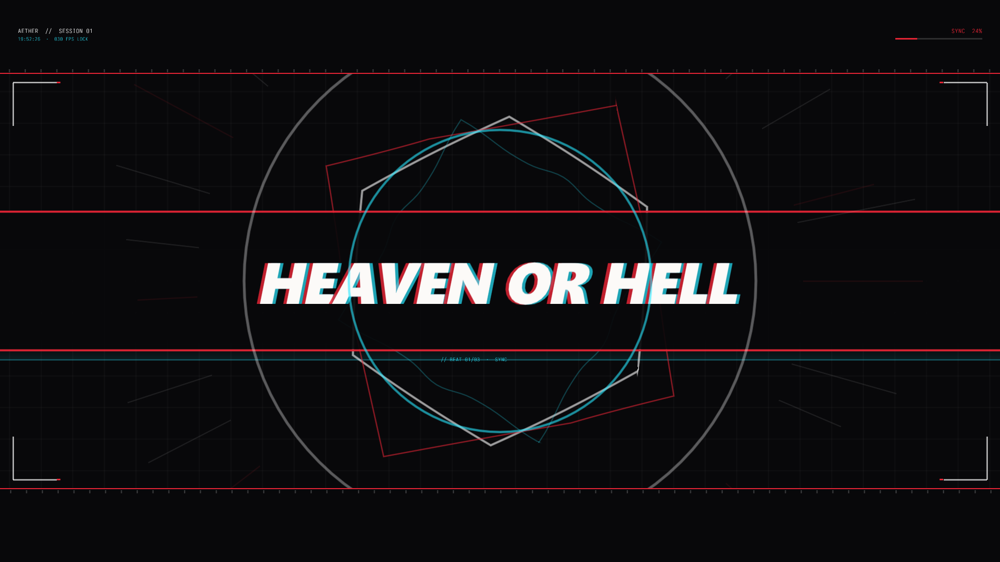
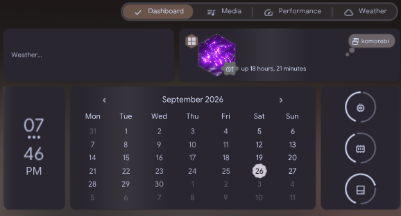
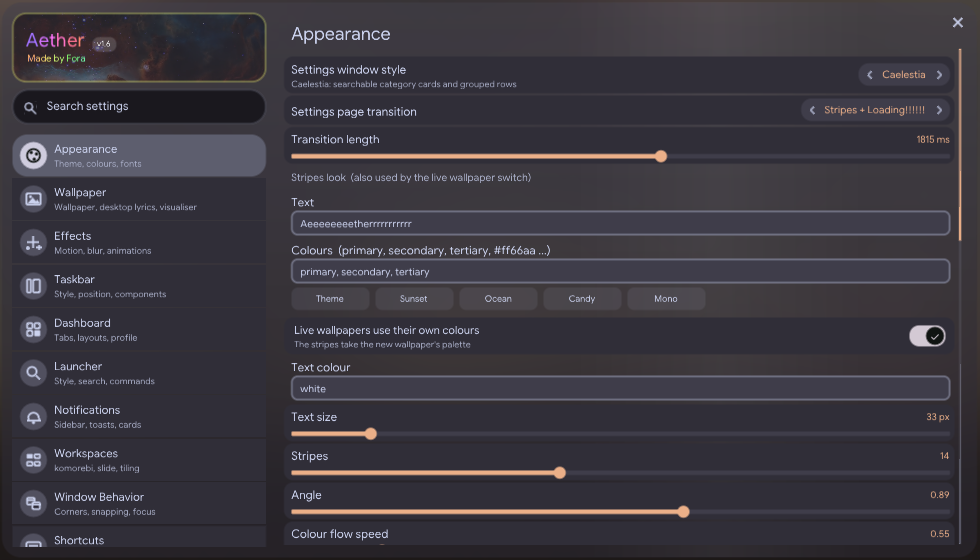
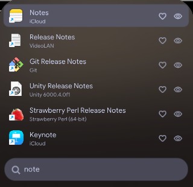
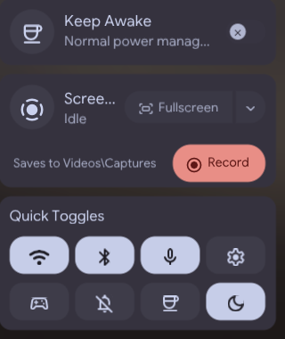
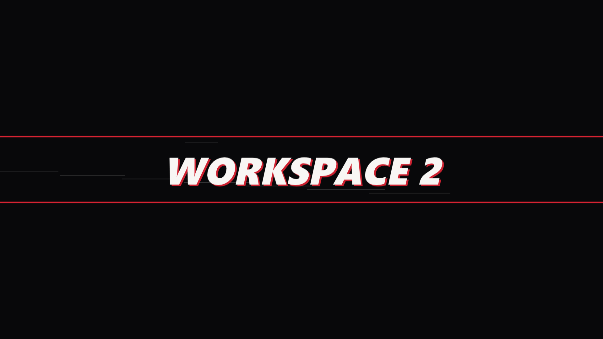
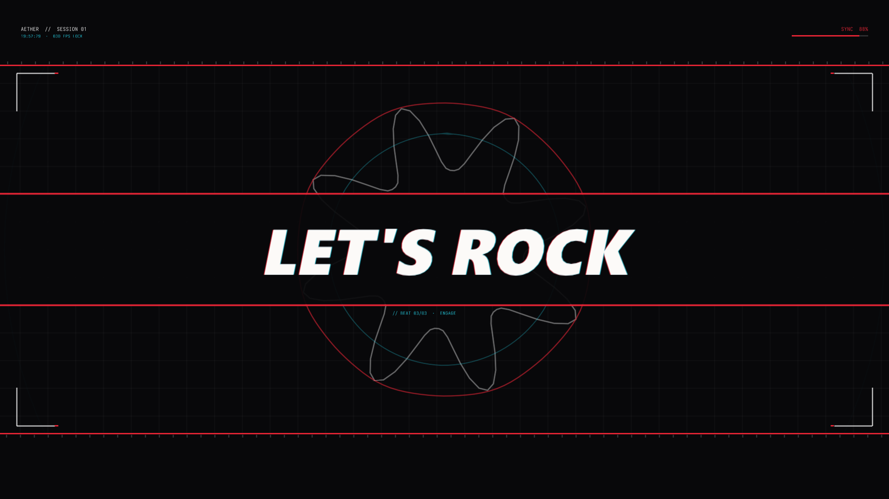

<h1 align=center>aether</h1>

<p align=center><i>Caelestia Shell, rebuilt natively for Windows.</i></p>

<div align=center>


</div>

<p align=center>
  <a href="docs/aether-demo.mp4"></a>
  <br><sub>▶ <a href="docs/aether-demo.mp4">Watch the full demo</a></sub>
</p>

<p align=center>
  
</p>

<p align=center>
  
  
</p>
<p align=center>
  
  
  
</p>

## Components

-   Widgets: native **Win32 + Direct3D 11 + DirectComposition**, drawn with [`Dear ImGui`](https://github.com/ocornut/imgui)
-   Window manager: [`komorebi`](https://github.com/LGUG2Z/komorebi) (optional - falls back to Windows virtual desktops)
-   Plugins: [`Lua 5.4`](https://www.lua.org), sandboxed per plugin
-   Sensors: a small [`LibreHardwareMonitor`](https://github.com/LibreHardwareMonitor/LibreHardwareMonitor) sidecar
-   Design: [`caelestia`](https://github.com/caelestia-dots/shell) - same Material 3 tokens, colours and motion curves

## Features

-   **Bar** - vertical or horizontal, any edge, per-monitor, workspaces, running apps with live previews, a real system tray (it hosts the icons itself) with the apps' own menus
-   **Dashboard** - weather, calendar, media, performance, custom tabs and freely placed widgets
-   **Launcher** - fuzzy app search, clipboard history, wallpaper picker, calculator, commands
-   **Lock screen** - a real blur of your desktop, Windows Hello and password, media and notifications
-   **Quick settings, notifications, OSD, power menu, file manager, snipping tool, screen recorder**
-   **Workspace overview** - a 3-D cube (or plane) of every workspace, live
-   **Motion graphs** - every panel and every keybind has its own editable curve, and rapid presses *speed the animation up* instead of being dropped
-   **Guilty Gear Strive motion** - see below
-   **Frost everywhere** - panels blur what is behind them (8.8 fixed-point blur, dithered at full size, no banding)
-   **Presets, themes, Material You colours from the wallpaper, Mica for every window, macros, keep-awake**

### Guilty Gear Strive motion

Fighting-game motion, all opt-in under **Settings > Effects > Guilty Gear Strive**:

| | |
|---|---|
| **Strive curve** | Panels slam past their size, freeze on a hit-stop, and snap into place. Stepped at 12-30 fps for the hand-drawn look Arc System Works uses. Pick it per panel or per keybind. |
| **Impact frames** | A white frame, a red frame, a blade tearing across the screen and a short shake when a panel opens. |
| **Workspace banner** | `WORKSPACE 2` slams onto a black-and-red plate, holds, and is sliced in half. |
| **Fight intro** | On startup and/or after unlocking: letterbox, HUD, a morphing emblem, letters that fly in and shatter, shockwaves, and a finale that breaks into shards. Any key skips it. |

<p align=center></p>

## Installation

> [!NOTE]
> Windows 10 1809 or newer, 64-bit. Aether runs **alongside** Explorer by default - replacing the Windows shell is a separate, optional step.

Download **`Aether-Setup.exe`** from the [latest release](https://github.com/crszy/Aether/releases/latest) and run it. It installs per user into
`%LOCALAPPDATA%\Programs\Aether` - no admin rights, and no runtime to install (the shell links the static CRT).

```
Aether-Setup.exe /S [/D=C:\path\to\install]     install silently
uninstall.exe /uninstall /S                     remove silently
```

| Optional | For |
|---|---|
| [komorebi](https://github.com/LGUG2Z/komorebi) | tiling workspaces, the workspace slide, the overview |
| .NET 8 Desktop Runtime | CPU / GPU temperature readouts (the sensor sidecar) |

### Replacing the Windows shell

> [!WARNING]
> Setup offers **"Replace the Windows shell (advanced)"**. It is per user (`HKCU\...\Winlogon\Shell`), so Safe Mode and every other account keep Explorer.
> The way back, in order of how much has gone wrong:
>
> 1. Run `RESTORE-EXPLORER.bat` (setup puts it on your desktop).
> 2. `Ctrl+Shift+Esc` → *Run new task* → `explorer.exe`.
> 3. From another account, delete the `Shell` value under `HKCU\Software\Microsoft\Windows NT\CurrentVersion\Winlogon`.

### Building from source

Requirements: **Visual Studio 2022** (Desktop development with C++), Python 3 (optional - generates the Settings search index), and the .NET 8 SDK if you want to rebuild the sensor sidecar.

```powershell
git clone https://github.com/crszy/Aether.git
cd Aether
.\build.ps1              # -> Aether.exe (builds lua54.lib the first time)
.\build-installer.ps1    # -> Aether-Setup.exe
```

> [!TIP]
> The icon themes and fonts under `linux\` (28,000 files) are not kept in git. `Aether.exe` runs without them with simpler icons; to get
> them, install the release once and copy its `linux\` folder next to your build - the installer script needs it too.

## Usage

| Keys | Action |
|---|---|
| `Super` | launcher |
| `Alt+Space` | launcher |
| `Super+Tab` / `Ctrl+Alt+E` | workspace overview |
| `Alt+Tab` | window switcher |
| `Ctrl+Alt+V` | clipboard history |
| `Ctrl+Alt+W` | wallpaper picker |
| `Ctrl+Alt+[` / `Ctrl+Alt+]` | previous / next wallpaper |
| `Ctrl+Shift+S` | snip a screenshot |
| `Ctrl+Alt+Q` | quit Aether |

Every shortcut is rebindable in **Settings > Shortcuts**. A running Aether also takes commands, like `caelestia shell -s`:

```
Aether.exe -s launcher | dashboard | quicksettings | lock | settings=<page> | overview | wallnext
Aether.exe -s set=<setting>=<value>        change any setting live
Aether.exe -s strive_intro                  preview the intro
```

## Configuration

Settings live in `config\*.toml` next to `Aether.exe`, one file per component, and every key is documented in place. The Settings app writes the same files, so edit whichever you like.

```toml
# config\motion.toml
[motion]
style = "strive"          # expressive | smooth | bounce | custom | strive ...
strive_fps = 15            # stepped frames for the strive curve, 0 = smooth
speed_up = true            # rapid presses compress the animation instead of being dropped
launcher_style = "global"  # every panel (and every keybind) can have its own curve

# config\strive.toml
[strive]
impact = true
workspace_banner = true
banner_text = "WORKSPACE %d"
intro_unlock = true
intro_lines = "HEAVEN OR HELL|DUEL %n|LET'S ROCK"
```

## Project layout

`main.cpp` is a list of `#include`s: the shell is split by section into `src/app/NN_*.cpp` but still compiles as **one** translation unit, so every section sees the ones before it.

```
src/app/         the shell, in order: core, stats, drawing, settings registry, desktop, dock, bar,
                 launcher, lock, Settings pages, notifications, window plumbing, wWinMain
src/modules/     Caelestia modules ported one-to-one (bar, dashboard, launcher, lock, overview, strive ...)
src/services/    komorebi, workspace slide, tiling animation, capture, safe launch, pacing
src/components/  Anim.h - Caelestia's Material 3 motion, the speed-up rule, the strive curve
```

## FAQ

**Does it replace Explorer?** Only if you ask it to. By default it runs on top, hides the Windows taskbar and gives it back on exit.

**Do I need komorebi?** No. Without it the bar drives Windows virtual desktops.

**How heavy is it?** About 5% of one core idle, and it never blocks your input: the keyboard hook has its own thread and every wait on the compositor has a timeout.

**Something froze or looks wrong.** `errors.log` and `stall.txt` next to `Aether.exe` name the exact section that was slow. Please attach them to an issue.

## Credits

-   [Caelestia Shell](https://github.com/caelestia-dots/shell) by the caelestia-dots authors - the design, tokens and behaviour Aether ports (GPL-3.0)
-   [Dear ImGui](https://github.com/ocornut/imgui), [Lua](https://www.lua.org), [komorebi](https://github.com/LGUG2Z/komorebi), [LibreHardwareMonitor](https://github.com/LibreHardwareMonitor/LibreHardwareMonitor)
-   [Flow Launcher](https://github.com/Flow-Launcher/Flow.Launcher) - the launcher's scoring algorithm (MIT)
-   [Material Symbols](https://github.com/google/material-design-icons), Google Sans Flex, Catppuccin
-   Motion inspired by *Guilty Gear -Strive-* (Arc System Works) - no game assets are used

See [`THIRD-PARTY.md`](THIRD-PARTY.md) and [`src/NOTICE.md`](src/NOTICE.md) for notices.

## License

Aether is a derivative work of Caelestia Shell and is licensed under the **[GNU GPL v3.0](LICENSE)**, like upstream.
